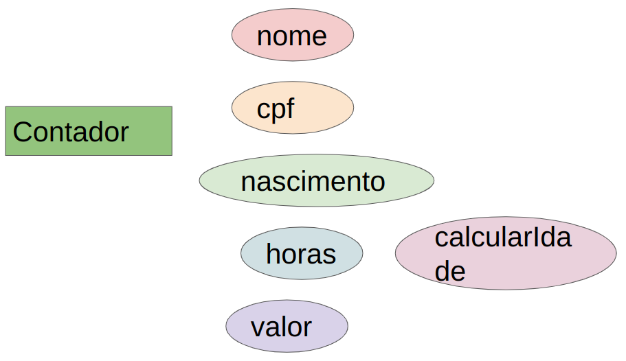
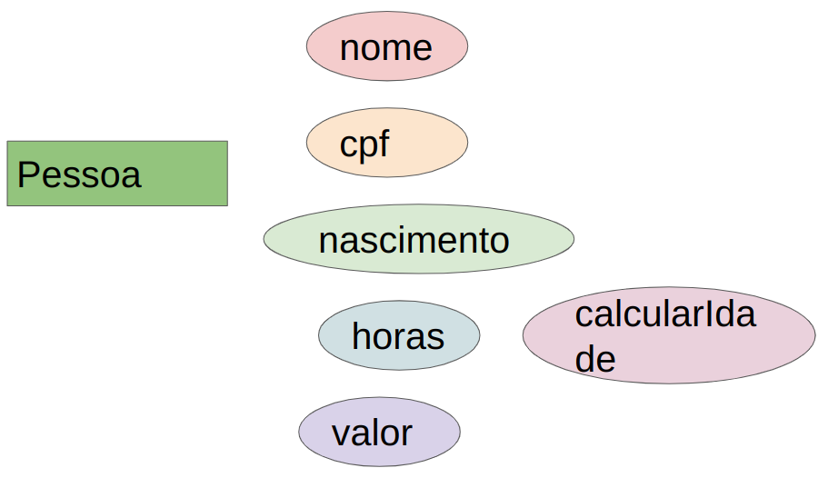

//caminho padrão para imagens
:imagesdir: 
:figure-caption: Figura
:doctype: book

//gera apresentacao
//pode se baixar os arquivos e add no diretório
:revealjsdir: https://cdnjs.cloudflare.com/ajax/libs/reveal.js/3.8.0

//GERAR ARQUIVOS
//make slides
//make ebook

= Herança

Trata-se de um relacionamento "é-um" na qual uma classe herda os atributos (variáveis de instância) e os comportamentos (métodos). Por exemplo: para elaborar uma tela basta criar uma classe X e estender a classe JFrame (classe disponibilizada pelo JDK). A classe X já vai possuir as características e funcionalidades de uma janela. Dessa forma, não é necessário criar um método que desenhe o frame, que maximize a tela ou diminua, estas funcionalidades já vem prontas.

A figura 1 mostra os atributos e comportamento da classe Contador

Figura 1

A figura 2 mostra os atributos e comportamento da classe Gerente

Figura 2

A figura 3 mostra a ideia de uma classe genérica que aborda os atributos e comportamento comuns entre as classes Contador e Gerente.

Exemplo um:
-link:um/Teste.java[Teste]
-link:um/Principal.java[Principal]
