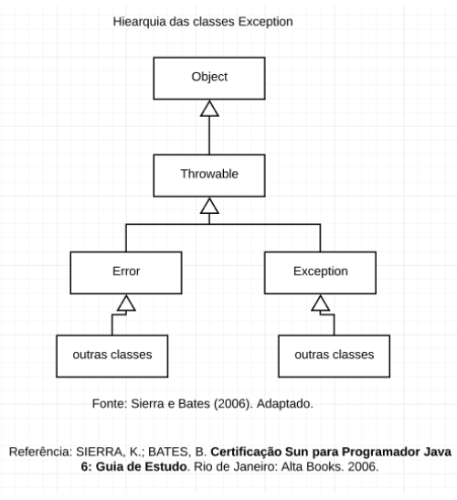

= Tratamento de Exceções

A linguagem Java apresenta um excelente suporte em relação aos tratamentos de exceções. 
Uma exceção é uma falha que pode ocorrer durante a execução de um programa. 
De acordo com Deitel e Deitel (2017, p. 201) "o tratamento de exceção ajuda a criar programas tolerantes a falhas que podem resolver (ou tratar) exceções. 
Em muitos casos, isso permite que um programa continue a executar como se nenhum problema fosse encontrado".

Referência do texto entre aspas: DEITEL, P. e DEITEL, H. Java: como programar. Tradução Edson Furmankiewicz. 
10ª ed. São Paulo: Pearson Education do Brasil, 2017.

Ambas as classes Error e Exception herdam da classe Throwable, porém estas representam grupos de classes distintas. A classe Error vai abranger as classes que representam problemas sérios e quando ocorrem não há muito o que fazer. Por exemplo: a classe VirtualMachineError pode indicar que a JVM consumiu os recursos disponíveis e precisa ser encerrada, a classe StackOverflowError indica que houve um estouro de pilha, a classe IOError indica erro grave na entrada e/ou saída de dados.

Subclasses da classe Error: AnnotationFormatError, AssertionError, AWTError, CoderMalfunctionError, FactoryConfigurationError, FactoryConfigurationError, IOError, LinkageError, ServiceConfigurationError, ThreadDeath, TransformerFactoryConfigurationError, VirtualMachineError.

A classe Exception representam problemas que podem ser capturados. Por exemplo: a classe ArithmeticException indica que ocorreu uma divisão por zero, a classe SQLException indica erros em acessar ao banco de dados. 

Subclasses da classe Exception: AclNotFoundException , ActivationException , AlreadyBoundException , ApplicationException , AWTException , BackingStoreException , BadAttributeValueExpException , BadBinaryOpValueExpException , BadLocationException , BadStringOperationException , BrokenBarrierException , CertificateException , CloneNotSupportedException , DataFormatException , DatatypeConfigurationException , DestroyFailedException , ExecutionException ,ExpandVetoException , FontFormatException , GeneralSecurityException , GSSException , IllegalClassFormatException , InterruptedException , IntrospectionException , InvalidApplicationException , InvalidMidiDataException , InvalidPreferencesFormatException , InvalidTargetObjectTypeException , IOException , JAXBException , JMException , KeySelectorException , LastOwnerException , LineUnavailableException ,MarshalException , MidiUnavailableException , MimeTypeParseException , MimeTypeParseException , NamingException , NoninvertibleTransformException , NotBoundException , NotOwnerException , ParseException , ParserConfigurationException , PrinterException , PrintException , PrivilegedActionException , PropertyVetoException , ReflectiveOperationException , RefreshFailedException , RemarshalException , RuntimeException, SAXException , ScriptException , ServerNotActiveException , SOAPException , SQLException , TimeoutException , TooManyListenersException , TransformerException , TransformException , UnmodifiableClassException , UnsupportedAudioFileException , UnsupportedCallbackException , UnsupportedFlavorException , UnsupportedLookAndFeelException , URIReferenceException , URISyntaxException , UserException ,XAException , XMLParseException , XMLSignatureException , XMLStreamException , XPathException.

Para mais detalhes:

- ORACLE. Class Throwable. Disponível em: https://docs.oracle.com/javase/7/docs/api/java/lang/Throwable.html. Acesso: 17 fev. 2023.
- ORACLE. Error. Disponível em: https://docs.oracle.com/javase/7/docs/api/java/lang/Error.html. Acesso: 17 fev. 2023.
- ORACLE. Excepion. Disponível em: https://docs.oracle.com/javase/7/docs/api/java/lang/Exception.html. Acesso: 17 fev. 2023.

Dentro da classe Exception também existe outras divisões. As exceções podem ser verificadas e não verificadas. As exceções verificadas são aquelas que necessitam ser tratadas em tempo de compilação, por exemplo, se o programador for usar algum método da classe IOException, o compilador vai exigir que seja manipulada através de um bloco try/catch ou declarada através da palavra throws. Já nas exceções não verificadas não é obrigatório a manipulação ou declaração. Por exemplo, quando o programador tenta acessar uma referência nula, lançando uma NullPointerException, isto não é verificado em tempo de compilação, mas somente em tempo de execução.

- Exemplo um:

import java.io.FileWriter;

import java.io.IOException;

public class Exemplo1 {

   public void metodo1() {

       File file = new File("meuArq.txt");

       try {    // tenta executar o código

           FileWriter fw = new FileWriter(file);  //para usar o FileWriter é obrigatório o uso do bloco try/catch 

       } catch (IOException e) {  //executado caso ocorra a falha

           e.printStackTrace();

       }

   }//metodo1

}//class

- Exemplo dois:

import java.io.File;

import java.io.FileWriter;

import java.io.IOException;

public class Exemplo1 {

   public void metodo1() throws IOException {  

       File file = new File("meuArq.txt");

       FileWriter fw = new FileWriter(file); //para usar o FileWriter é obrigatório usar o throws.

      }//metodo1

}//class

import java.io.IOException;

public class Principal {

   public static void main(String[] args) {

       Exemplo1 exemplo1 = new Exemplo1();

       try {

           exemplo1.metodo1();   //observe que aqui é necessário usar o bloco try/catch, o throws delega para a classe que for usar o recurso manipular a exceção.

       } catch (IOException e) {

           e.printStackTrace();

       }

   }

}//class

- Exemplo três:

public class Exemplo1 {

   public void metodo1()  {

       float media = 5/0;

   }//metodo1

}//class

public class Principal {

   public static void main(String[] args) {

       Exemplo1 exemplo1 = new Exemplo1();

       exemplo1.metodo1();

   }

}

Execute o programa e veja a saída:

Exception in thread "main" java.lang.ArithmeticException: / by zero

	at Exemplo1.metodo1(Exemplo1.java:3)

	at Principal.main(Principal.java:4)

Como trata-se de uma java.lang.ArithmeticException não é obrigatório manipular ou declarar a exceção, mas você pode fazê-lo. Veja o exemplo modificado.

public class Exemplo1 {

   public void metodo1()  {

       try{

           float media = 5/0;

       }catch (ArithmeticException e){

           System.err.println("não é possível divisão por zero");  //executado caso ocorra a tentativa de divisão por zero.

       }

   }//metodo1

}//class

Execute novamente e veja o resultado: 

não é possível divisão por zero

A exceção ocorreu, porém com o tratamento, foi possível emitir uma mensagem do erro compreensível ao usuário. A saída anterior é compreensível apenas para o programador que esta habituado com a linguagem.

