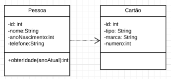
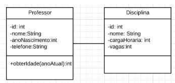
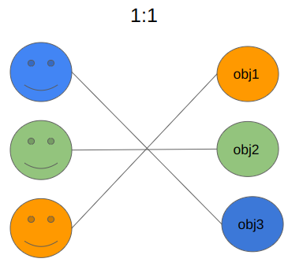
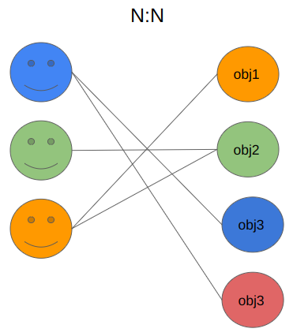

//caminho padrão para imagens
 
:figure-caption: Figura
:doctype: book

//gera apresentacao
//pode se baixar os arquivos e add no diretório
:revealjsdir: https://cdnjs.cloudflare.com/ajax/libs/reveal.js/3.8.0

//GERAR ARQUIVOS
//make slides
//make ebook

= Relacionamentos entre Classes

As classes podem ter ligações com outras classes. Essas ligações são chamadas de relacionamentos. Veja os seguintes exemplos: 
- uma pessoa pode usar o cartão de crédito, se considerarmos Pessoa e Cartão duas classes, observe-se que é possível visualizar um relacionamento de necessidade;
- um contador, um professor, um administrador, se fossemos representar as três classes em um sistema, os dados nome, cpf, data de nascimento são presentes nas três classes, observe-se que é possível generalizar as três classes em uma classe mais genérica chamada Pessoa;
- um formulário pode ter um campo de texto, um botão, uma imagem. Um formulário, um campo de texto, um botão e uma imagem, todos podem ser classes em um sistema, porém, as classes campo de texto, um botão e uma imagem são partes que formam a classe Formulário, observe- se é possível visualizar um relacionamento que classes fazem parte da estrutura de um todo.

Em todos os exemplos acima, temos um tipo de relacionamento entre as classes que podem ser representados no processo de codificação. Essas representações podem ser feitas via: dependência, associação, associação por agregação, associação por composição e generalização.

= Dependência

No relacionamento de dependência entre duas classes, uma classe A precisa de alguns recursos da classe B, porém a classe B não necessita da classe A.
Observe na figura 1 ao lado que a classe Pessoa precisa usar os dados contidos na classe Cartão, mas o contrário não acontece. A dependência é representada na codificação por um método que possui como parâmetro uma variável com o tipo da outra classe.

Exemplo: public void usar(Cartao c) { ... }

Figura 1

= Associação

No relacionamento de associação, a classe passa a fazer parte da estrutura da outra. A associação pode ser bilateral ou unilateral.
Observe a figura 2: uma disciplina é ministrada por um professor ou um professor ministra uma ou várias disciplinas. Na associação as classes possuem a mesma importância. Na codificação é representada por uma variável de instância.

Exemplo: public class Disciplina{

	private int id, cargaHoraria, vagas;
	private String nome;
	private Professor p;
 
}

Figura 2

= Navegabilidade e Multiplicidade

1 x 1 (A figura 3 demostra um exemplo da multiplicidade um para um)

Figura 3

1 x N (A figura 4 demostra um exemplo da multiplicidade um para vários)

Figura 4

N x N (A figura 5 demostra um exemplo da multiplicidade vários para vários)

Figura 5

= Agregação x Composição

Tanto a agregação como a composição são tipos de associação, ou seja, uma classe vai ter  uma variável de instância do tipo de outra classe. Na agregação e na composição tem-se a ideia de todo-parte, porém com suas particularidades. Na agregação quando o todo deixa de existir, as partes podem continuar ativas no sistema. Na composição quando o todo deixa de existir, as partes devem ser excluídas no sistema.

Segundo (BEZERRA, 2007, p. 123):

"Agregações/composições são assimétricas, no sentido de que, se um objeto A é parte de um objeto B, o objeto B não pode ser parte do objeto A."

"Nas agregações/composições, as partes são normalmente criadas e destruídas pelo todo. Na classe do objeto todo, são definidas operações para adicionar e remover as partes."

- Referência do texto entre aspas: BEZERRA, E. Princípios de Análise e Projeto de Sistemas com UML. Rio de Janeiro: Elsevier, 2007.

Exemplos práticos (agregação):

- link:codigos/aula_quatro/Jogador.java[Jogador]
- link:codigos/aula_quatro/Time.java[Time]
- link:codigos/aula_quatro/Principal.java[Principal]

Exemplos práticos (composição):

- link:codigos/aula_quatro/Jogador2.java[Jogador]
- link:codigos/aula_quatro/Time2.java[Time]
- link:codigos/aula_quatro/Principal2.java[Principal]

= Associações e Classes Associativas / Ordinárias

Exemplos práticos:

- link:codigos/aula_quatro/Medico.java[Medico]
- link:codigos/aula_quatro/Consulta.java[Consulta]
- link:codigos/aula_quatro/Paciente.java[Paciente]
- link:codigos/aula_quatro/Principal3.java[Principal]

