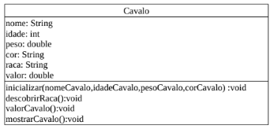

//caminho padrão para imagens
 
:figure-caption: Figura
:doctype: book

//gera apresentacao
//pode se baixar os arquivos e add no diretório
:revealjsdir: https://cdnjs.cloudflare.com/ajax/libs/reveal.js/3.8.0

//GERAR ARQUIVOS
//make slides
//make ebook

= Construtores

Observe na figura 1, o diagrama de classe mostra as variáveis e métodos da classe Cavalo. Atenção ao método inicializar, este método recebe os parâmetros para que os valores sejam atribuídos às variáveis de instância. 

Figura 1

A linguagem Java tem um recurso que tem o mesmo propósito que o método inicializar da classe Cavalo. Este recurso é chamado de construtores. As diferenças entre o construtor e o método inicializar é que o construtor é chamado apenas uma única vez durante todo o ciclo de vida, no momento da instanciação, ou seja, quando o objeto está sendo criado na memória. Construtores não possuem retorno e devem ter o mesmo nome da classe.

- link:codigos/Cavalo.java[Cavalo] 
- link:codigos/Principal_Cavalo.java[Principal]

Os construtores podem ter várias versões, ou seja, sobrecarregados. Uma classe pode apresentar mais de uma versão de construtor.

- link:codigos/Cavalo2.java[Cavalo]

A versão do construtor a ser chamado vai depender da quantidade de argumentos presentes no momento da instanciação. Por exemplo:

- Cavalo c1 = new Cavalo("Pé de Pano", 100, 5);    //para chamar a versão 1
- Cavalo c2 = new Cavalo("Pé de Pano", 5);    //para chamar a versão 2
- Cavalo c3 = new Cavalo("Pé de Pano");   //para chamar a versão 3

Inicialmente tem-se o hábito de acessar as variáveis de instância diretamente, por exemplo: c1.nome = "Pé de Pano", porém isto não é uma boa prática de programação, pois além das classes conhecerem detalhes internos das outras, isto pode prejudicar a manutenção de código. Dessa forma, o ideal é proteger o acesso às variáveis com o modificador private e permitir o acesso somente através do métodos getters e setters.

O método GET é usado quando se deseja obter o valor da variável de instância.

 public String getNome(){
 
	   return this.nome;     //neste caso, o retorno é o conteúdo da variável nome
	   
}

 public int getIdade(){
 
	   return this.idade;     //neste caso, o retorno é o conteúdo da variável idade
	   
}

O método get sempre vai ter um retorno.

O método é usado quando se deseja alterar o valor da variável de instância.

public void setNome(String nome){

	this.nome = nome;     //neste caso, o conteúdo da variável nome é alterado
	
}

public void setIdade(int idade){

	this.idade = idade;     //neste caso, o conteúdo da variável idade é alterado
	
}

O método set sempre vai void.

O método é usado com a finalidade de descrever TEXTUALMENTE um objeto. Toda classe herda o método toString() da classe Object (mãe/pai de todas as classes no Java). Quando você executa a linha de código:

Cavalo c1 = new Cavalo();

System.out.println(c1);   //será impresso o endereço de memória do objeto.

Porém se o método toString() for sobrescrito,será impressa uma descrição do objeto. Na classe Cavalo se acrescentarmos o seguinte método:

public String toString(){

	return "o nome do cavalo: " +this.nome;
	
}

e no método main() usarmos:
System.out.println(c1);    //será impresso o nome do cavalo: Pé de Pano

= Modificadores de Acesso

Os modificadores de acesso vão definir a visibilidade de uma classe (criar uma instância dela ou estendê-la) e acesso aos seus membros: variáveis e métodos. Inicialmente deve-se olhar se a classe é visível para as demais e depois analisar a visibilidade de seus membros. Existem quatro modificadores de acesso: public, protected, default e private.

